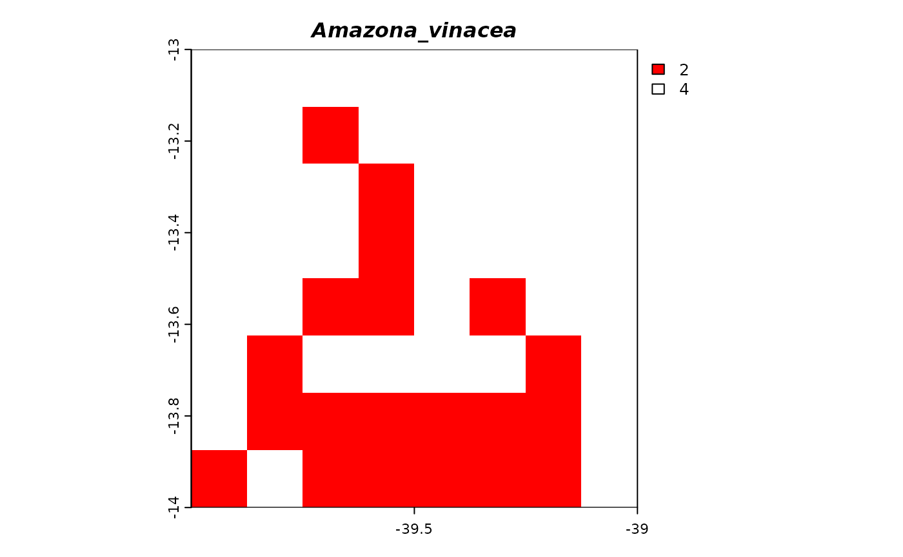

# divraster-vignette

- [1 Introduction](#intro)
- [2 Alpha diversity](#alpha)
  - [2.1 Alpha examples](#alpha-ex)
    - [2.1.1 Alpha TD](#alpha-td)
    - [2.1.2 Alpha FD](#alpha-fd)
    - [2.1.3 Alpha PD](#alpha-pd)
- [3 Standardized effect size (SES)](#ses)
  - [3.1 SES examples](#ses-ex)
    - [3.1.1 SES FD](#ses-fd)
    - [3.1.2 SES PD](#ses-pd)
- [4 Beta diversity](#beta)
  - [4.1 Beta examples](#betaspat-ex)
    - [4.1.1 Beta spatial TD](#betaspat-td)
    - [4.1.2 Beta spatial FD](#betaspat-fd)
    - [4.1.3 Beta spatial PD](#betaspat-pd)
    - [4.1.4 Beta temporal TD](#betatemp-td)
    - [4.1.5 Beta temporal FD](#betatemp-fd)
    - [4.1.6 Beta temporal PD](#betatemp-pd)
- [5 Traits average](#traits-avg)
  - [5.1 Traits average examples](#traits-ex)
- [6 Suitability change](#suit-change)
- [7 Area calculation](#area-calc)
- [8 Richness difference between scenarios](#differ)

## 1 Introduction

Macroecological studies have been increasingly utilized in the context
of climate change, necessitating the use of tools to analyze large
datasets. To examine and comprehend the intricate mechanisms that
underlie species distributions and the structure of biological
communities, a diverse array of metrics has been developed. These
metrics encompass alpha and beta diversity patterns across taxonomic
(TD), functional (FD), and phylogenetic (PD) dimensions. The package
`divraster` addresses a current gap in this field by offering functions
to calculate diversity metrics directly from rasters, eliminating the
need for matrix transformations. This capability is especially valuable
when dealing with extensive datasets, as matrices often impose memory
constraints.

## 2 Alpha calculations

Alpha diversity calculations use a tree-based approach for taxonomic
(TD), functional (FD), and phylogenetic (PD) diversity. In the FD
calculation, a species traits matrix is converted into a distance matrix
and clustered to produce a regional dendrogram (i.e. a dendrogram with
all species in the raster stack) from which the total branch length is
calculated. When calculating FD for each community (i.e. raster cell),
the regional dendrogram is subsetted into a local dendrogram containing
only the species present on the local community, and only the branch
lengths connecting them are summed to represent the functional
relationships of the species locally present. Similarly, in PD, the sum
of branch lengths connecting species within a community represents their
shared phylogenetic relationships and cumulative evolutionary history.
Alpha TD can also be visualized using a tree diagram, where each species
is directly connected to the root by an edge of unit length, reflecting
the number of different taxa in the community (i.e. species richness)
since all taxa are at the same level.

## 2.1 Alpha examples

## 2.1.1 Alpha TD

``` r
# Loading data
# Presence-absence SpatRaster
bin1 <- terra::rast(system.file("extdata", 
                                "ref_frugivor.tif", 
                                package = "divraster"))
bin2 <- terra::rast(system.file("extdata",
                                "fut_frugivor.tif",
                                package = "divraster"))

# Change extension to process faster
terra::ext(bin1)
#> SpatExtent : -41.875, -38.75, -21.375, -13 (xmin, xmax, ymin, ymax)
e <- c(-40, -39, -14, -13)
bin1 <- terra::crop(bin1, e)
bin2 <- terra::crop(bin2, e)

# Species traits
traits <- read.csv(system.file("extdata", 
                               "traits_frugivor.csv", 
                               package = "divraster"), 
                   sep = ";", 
                   row.names = 1)

# Phylogenetic tree
tree <- ape::read.tree(system.file("extdata", 
                                   "tree_frugivor.tre", 
                                   package = "divraster"))

# Alpha TD calculation for scenario 1
divraster::spat.alpha(bin1)
#> class       : SpatRaster 
#> size        : 8, 8, 1  (nrow, ncol, nlyr)
#> resolution  : 0.125, 0.125  (x, y)
#> extent      : -40, -39, -14, -13  (xmin, xmax, ymin, ymax)
#> coord. ref. : lon/lat WGS 84 (EPSG:4326) 
#> source(s)   : memory
#> name        : Alpha_TD 
#> min value   :        0 
#> max value   :       67

# Alpha TD calculation for scenario 2
divraster::spat.alpha(bin2)
#> class       : SpatRaster 
#> size        : 8, 8, 1  (nrow, ncol, nlyr)
#> resolution  : 0.125, 0.125  (x, y)
#> extent      : -40, -39, -14, -13  (xmin, xmax, ymin, ymax)
#> coord. ref. : lon/lat WGS 84 (EPSG:4326) 
#> source(s)   : memory
#> name        : Alpha_TD 
#> min value   :        0 
#> max value   :       65
```

The alpha taxonomic diversity in the first scenario ranges from 0 to 67,
and in the second scenario, it ranges from 0 to 65, with higher values
concentrated towards the north in both cases.

## 2.1.2 Alpha FD

``` r
divraster::spat.alpha(bin1, traits)
```

The alpha functional diversity for the first scenario ranges from
4.248408 to 4.378846, with higher values concentrated towards the north,
indicating greater functional diversity.

## 2.1.3 Alpha PD

``` r
# Alpha PD calculation
divraster::spat.alpha(bin1, tree)
#> class       : SpatRaster 
#> size        : 8, 8, 1  (nrow, ncol, nlyr)
#> resolution  : 0.125, 0.125  (x, y)
#> extent      : -40, -39, -14, -13  (xmin, xmax, ymin, ymax)
#> coord. ref. : lon/lat WGS 84 (EPSG:4326) 
#> source(s)   : memory
#> name        : Alpha_PD 
#> min value   : 1793.342 
#> max value   : 1859.668
```

The alpha phylogenetic diversity for the first scenario ranges from
1793.342 to 1859.668, with higher values concentrated towards the north,
indicating greater phylogenetic diversity.

## 3 Standardized effect size (SES)

SES is often used in ecological studies to measure the magnitude of
difference between observed and randomized patterns generated by null
models, expressed in standard deviation units. We calculate SES using
the `SESraster` package, which currently offers six community
randomization methods. The basic randomization methods include: keeping
the richness constant and randomizing the position of the species within
each raster cell (site), keeping range size constant and randomizing the
position of species presences in space (species), and randomizing by
both site and species simultaneously (both). A positive SES indicates
that the observed functional/phylogenetic diversity is higher than
expected solely based on species richness (taxonomic diversity), whereas
a negative SES indicates the opposite.

## 3.1 SES examples

## 3.1.1 SES FD

``` r
# SES FD calculation
divraster::spat.rand(x = bin1, 
                     tree = traits, 
                     aleats = 3, 
                     random = "site")
```

The SES indicates that the majority of the areas have values close to 0,
suggesting that functional diversity does not significantly differ from
the expected change. However, one community is projected to be
functionally clustered (SES_FD = -25).

## 3.1.2 SES PD

``` r
# SES PD calculation
divraster::spat.rand(x = bin1, 
                     tree = tree, 
                     aleats = 3, 
                     random = "site")
```

In contrast, the SES for phylogenetic diversity does not differ from
what is expected by chance, with most communities presenting values
close to 0. However, one community is projected to be phylogenetically
dispersed (SES_PD = 12).

## 4 Beta diversity

Beta diversity captures variations in species composition between
different communities. When examining a community in comparison to its
neighboring ones, it is referred to as spatial beta diversity. On the
other hand, when assessing changes within the same community over
different time periods, it is termed temporal beta diversity. Beta
diversity can further be partitioned into two components: “replacement”
and “richness differences”. The former accounts for the substitution of
one species with another, while the latter encompasses discrepancies in
the total number of species (e.g. species gain or loss). In addition,
since Btotal represents the sum of Brepl and Brich components, the
proportion of Brepl/Btotal (Bratio) can be calculated, with values close
to 0 indicating the predominance of Brich and values close to 1
indicating the predominance of Brepl. Moreover, the concept of beta
diversity extends to functional (FD) and phylogenetic diversity (PD),
using the same framework as taxonomic diversity (TD). In the context of
TD, higher beta diversity represents higher dissimilarities in species
composition between communities. In contrast, for FD, it indicates
higher dissimilarities in functional traits, and for PD, it reflects
higher dissimilarities in phylogenetic relationships of species between
communities.

## 4.1 Beta examples

## 4.1.1 Beta spatial TD

``` r
# Beta spatial TD calculation
divraster::spat.beta(bin1)
```

Spatial beta diversity for TD indicates a slight change in species
composition towards the south, as evidenced by the small values of
Btotal (ranging from 0.002985075 to 0.045232793). The predominant
component contributing to this change is the richness difference
(Brich), suggesting that dissimilarities between each community
(i.e. pixel) and its neighbors are primarily due to the loss or gain of
species.

## 4.1.2 Beta spatial FD

``` r
# Beta spatial FD calculation
divraster::spat.beta(bin1, traits)
```

Similarly, spatial beta diversity for FD indicates a slight change in
functional traits composition towards the south, as evidenced by the
small values of Btotal (ranging from 0.0001674408 to 0.0235750070). The
predominant component contributing to this little change is the richness
difference (Brich), suggesting that dissimilarities between each
community (i.e. pixel) and its neighbors are primarily due to the loss
or gain of functional traits.

## 4.1.3 Beta spatial PD

``` r
# Beta spatial PD calculation
divraster::spat.beta(bin1, tree)
```

The spatial beta diversity for PD also indicates a slight change in the
evolutionary history of communities towards the south, as evidenced by
the small values of Btotal (ranging from 0.0008262028 to 0.0190497319).
The predominant component contributing to this little change is also the
richness difference (Brich), suggesting that dissimilarities between
each community (i.e. pixel) and its neighbors are due to the loss or
gain of evolutionary history.

## 4.1.4 Beta temporal TD

``` r
# Beta temporal TD calculation
divraster::temp.beta(bin1, bin2)
#> class       : SpatRaster 
#> size        : 8, 8, 4  (nrow, ncol, nlyr)
#> resolution  : 0.125, 0.125  (x, y)
#> extent      : -40, -39, -14, -13  (xmin, xmax, ymin, ymax)
#> coord. ref. : lon/lat WGS 84 (EPSG:4326) 
#> source(s)   : memory
#> names       :  Btotal_TD,   Brepl_TD,   Brich_TD, Bratio_TD 
#> min values  : 0.02985075, 0.00000000, 0.02985075, 0.0000000 
#> max values  : 0.13636364, 0.06153846, 0.13636364, 0.5714286
```

The temporal beta diversity for TD indicates that future communities in
the north are expected to experience changes in their species
composition. This is driven by the Brich component, suggesting these
dissimilarities are attributed to gains or losses of species.

## 4.1.5 Beta temporal FD

``` r
# Beta temporal FD calculation
divraster::temp.beta(bin1, bin2, traits)
#> class       : SpatRaster 
#> size        : 8, 8, 4  (nrow, ncol, nlyr)
#> resolution  : 0.125, 0.125  (x, y)
#> extent      : -40, -39, -14, -13  (xmin, xmax, ymin, ymax)
#> coord. ref. : lon/lat WGS 84 (EPSG:4326) 
#> source(s)   : memory
#> names       :  Btotal_FD,   Brepl_FD,    Brich_FD, Bratio_FD 
#> min values  : 0.01358064, 0.00000000, 0.007364383, 0.0000000 
#> max values  : 0.07041225, 0.02160415, 0.070412255, 0.7457799
```

The temporal beta diversity for FD indicates a less pronounced pattern
compared to TD, with smaller values of Btotal. The Brich component is
also predominant, suggesting that the small dissimilarities can be
attributed to gains or losses of functional traits.

## 4.1.6 Beta temporal PD

``` r
# Beta temporal PD calculation
divraster::temp.beta(bin1, bin2, tree)
#> class       : SpatRaster 
#> size        : 8, 8, 4  (nrow, ncol, nlyr)
#> resolution  : 0.125, 0.125  (x, y)
#> extent      : -40, -39, -14, -13  (xmin, xmax, ymin, ymax)
#> coord. ref. : lon/lat WGS 84 (EPSG:4326) 
#> source(s)   : memory
#> names       :  Btotal_PD,  Brepl_PD,   Brich_PD, Bratio_PD 
#> min values  : 0.01202170, 0.0000000, 0.01202170, 0.0000000 
#> max values  : 0.08652411, 0.0394096, 0.08652411, 0.6232362
```

Likewise, the temporal beta diversity for PD indicates a less pronounced
pattern compared to TD, with smaller values of Btotal. The Brich
component is also predominant, suggesting that the small dissimilarities
can be attributed to gains or losses of evolutionary history.

## 5 Traits average

Calculating the average traits of species for each climate scenario
enables the evaluation of species traits that contribute the most to the
loss of suitable habitat. Unlike functional diversity, which combines
functional traits into an index, this approach provides direct insight
into spatial variations in average traits. This information can
complement the data necessary for delineating conservation priority
areas, as shifts in average traits—whether increasing or
decreasing—indicate the potential loss of species with specific
features. This is of particular significance given that functional
traits are closely tied to the ecological services provided by species.

## 5.1 Traits average examples

``` r
# Average traits calculation
# Scenario 1
divraster::spat.trait(bin1, traits)
#> class       : SpatRaster 
#> size        : 8, 8, 12  (nrow, ncol, nlyr)
#> resolution  : 0.125, 0.125  (x, y)
#> extent      : -40, -39, -14, -13  (xmin, xmax, ymin, ymax)
#> coord. ref. : lon/lat WGS 84 (EPSG:4326) 
#> source(s)   : memory
#> names       : Beak.~ulmen, Beak.~Nares, Beak.Width, Beak.Depth, Tarsu~ength, Wing.Length, ... 
#> min values  :    23.95758,    15.97879,   7.613636,   9.250000,    25.55224,    117.9833, ... 
#> max values  :    24.36250,    16.28333,   7.804545,   9.601515,    25.89531,    120.3712, ...

# Scenario 2
divraster::spat.trait(bin2, traits)
#> class       : SpatRaster 
#> size        : 8, 8, 12  (nrow, ncol, nlyr)
#> resolution  : 0.125, 0.125  (x, y)
#> extent      : -40, -39, -14, -13  (xmin, xmax, ymin, ymax)
#> coord. ref. : lon/lat WGS 84 (EPSG:4326) 
#> source(s)   : memory
#> names       : Beak.~ulmen, Beak.~Nares, Beak.Width, Beak.Depth, Tarsu~ength, Wing.Length, ... 
#> min values  :    23.22833,    15.01000,   7.336667,   8.918333,    25.65077,    118.2877, ... 
#> max values  :    25.15000,    16.84655,   7.905172,   9.598276,    26.57241,    122.3655, ...
```

The average beak depth in the first scenario ranges from 9.25 to 9.6,
while in the second scenario, it ranges from 8.9 to 9.6. The reduction
in beak size can be attributed to the decline of species with larger
beak depths.

## 6 Suitability change

``` r
# Suitability change between climate scenarios
change <- divraster::suit.change(bin1[[1:4]], bin2[[1:4]])

# Visualization
# Initialize an empty list to store color mappings for each layer
change.col <- list()

# Loop through each layer in the 'change' raster
for(i in 1:terra::nlyr(change)){
  # Get unique values, omitting NA values, and sort them
  change.col[[i]] <- sort(na.omit(unique(terra::values(change[[i]]))))
  
  # Map numeric values to specific colors
  change.col[[i]][change.col[[i]] == 1] <- "blue"   # Gain
  change.col[[i]][change.col[[i]] == 2] <- "red"    # Loss
  change.col[[i]][change.col[[i]] == 3] <- "grey"   # No change
  change.col[[i]][change.col[[i]] == 4] <- "white"  # Unsuitable
  
  # Plot the change in suitability
  terra::plot(change[[i]], col = change.col[[i]], 
              main = names(change)[i],
              cex.main = 1,          
              font.main = 4)  
}
```


Suitability change between climate scenarios with values equals 1
representing gain, values equals 2 representing loss, values equals 3
representing no change, and values equals 4 representing unsuitable in
both scenarios.

## 7 Area calculation

``` r
# Climate suitable area scenario 1
divraster::area.calc(bin1[[1:4]])
#>                   Layer     Area
#> 1      Amazona_farinosa 7686.712
#> 2  Amazona_rhodocorytha 7686.712
#> 3       Amazona_vinacea 3749.616
#> 4 Arremon_semitorquatus    0.000

# Climate suitable area scenario 2
divraster::area.calc(bin2[[1:4]])
#>                   Layer     Area
#> 1      Amazona_farinosa 7686.712
#> 2  Amazona_rhodocorytha 7686.712
#> 3       Amazona_vinacea    0.000
#> 4 Arremon_semitorquatus    0.000
```

The climate suitable area for species such as *Amazona farinosa* is
expected to remain the same (7,686 km$^{2}$), while for species such as
*Amazona vinacea* climate suitability is expected to be eliminated (a
100% reduction).

## 8 Richness difference between scenarios

``` r
# Difference in species richness between climate scenarios
divraster::differ.rast(divraster::spat.alpha2(bin1),
                       divraster::spat.alpha2(bin2), perc = FALSE)
#> class       : SpatRaster 
#> size        : 8, 8, 1  (nrow, ncol, nlyr)
#> resolution  : 0.125, 0.125  (x, y)
#> extent      : -40, -39, -14, -13  (xmin, xmax, ymin, ymax)
#> coord. ref. : lon/lat WGS 84 (EPSG:4326) 
#> source(s)   : memory
#> name        : Absolute_Difference 
#> min value   :                  -9 
#> max value   :                  -2
```

When comparing the two scenarios, subtracting the second from the first
reveals greater species losses (n = 9) in the north.
